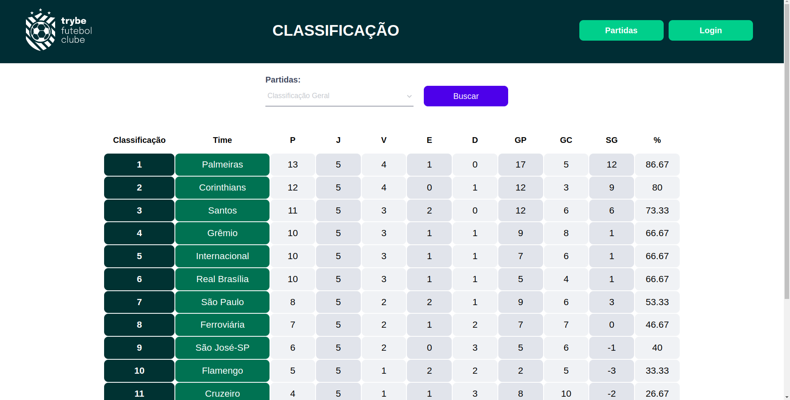

<h1>Trybe Football Club</h1>

Management of the greatest football championship in history.

<h2>🚀 Objective</h2>

The objective was to create an API to manage a football championship with all the statistics such as points, goal difference, and performance. It includes sorting the standings based on home games, away games, and overall ranking. The API provides endpoints for user login with password encryption, registering a new match, finalizing a match, and fetching data for a specific match. All requests are validated using user tokens.
 

Starting a new application is always the most challenging part, and putting all the knowledge into practice in a single project was truly incredible. Orchestrating an entire application using Docker, considering all dependencies, and handling errors for every possible invalidation situation.

<h2>🛠️ Built with</h2>
<strong><em>TypeScript</em></strong> 
<strong><em>POO</em></strong> 
<strong><em>SOLID</em></strong> 
<strong><em>JWT</em></strong> 
<strong><em>Node.js</em></strong> 
<strong><em>REST API</em></strong> 
<strong><em>Express.js</em></strong> 
<strong><em>Sequelize</em></strong> 
<strong><em>Docker</em></strong> 

<h3>Project look</h3>

<h2>🎁 Expressions of Gratitude</h2>

Tell others about this project. 📢

